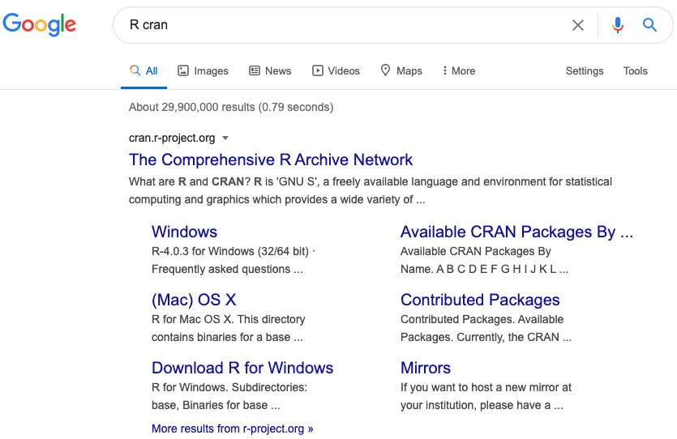
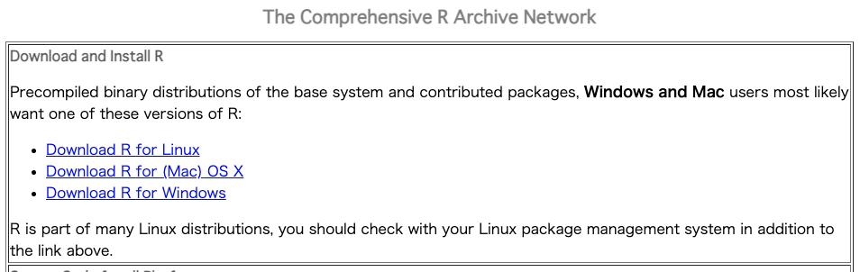
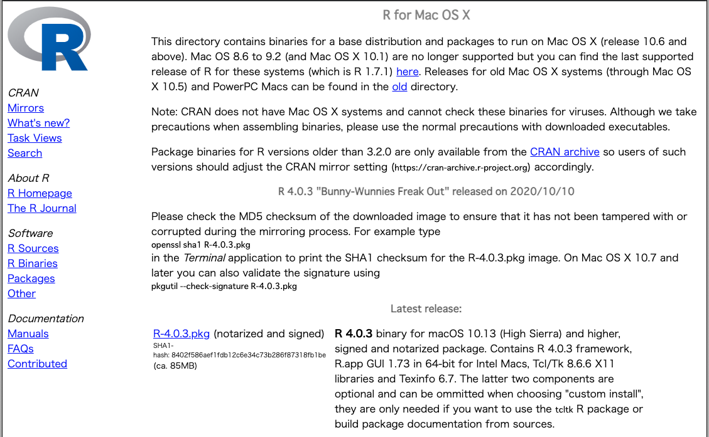
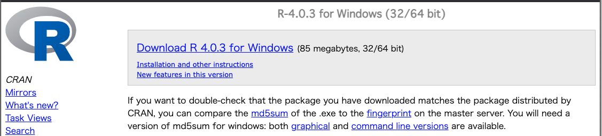
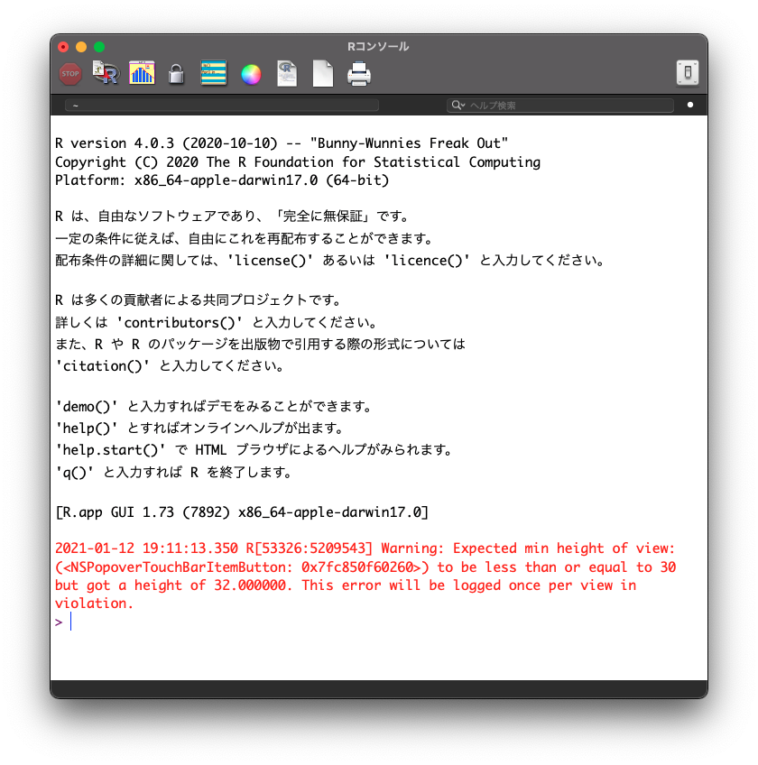
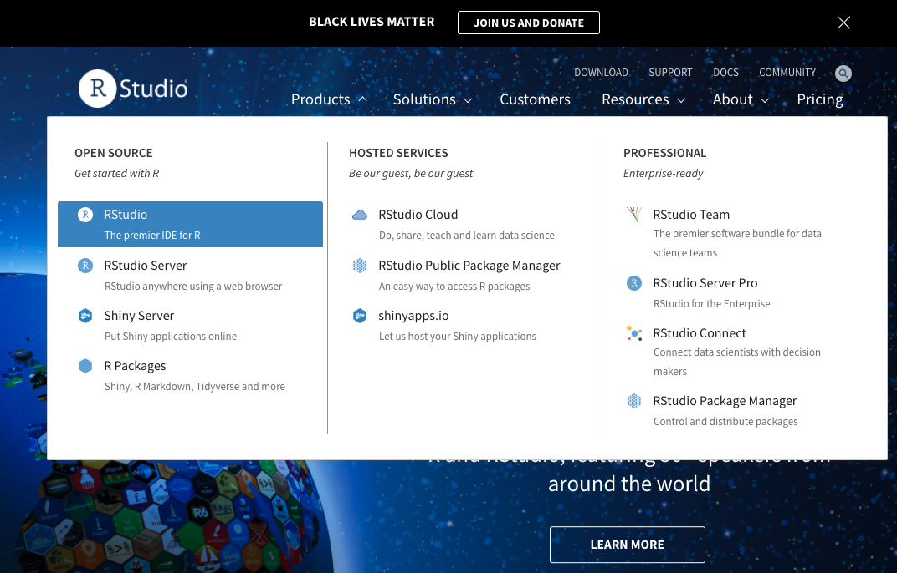
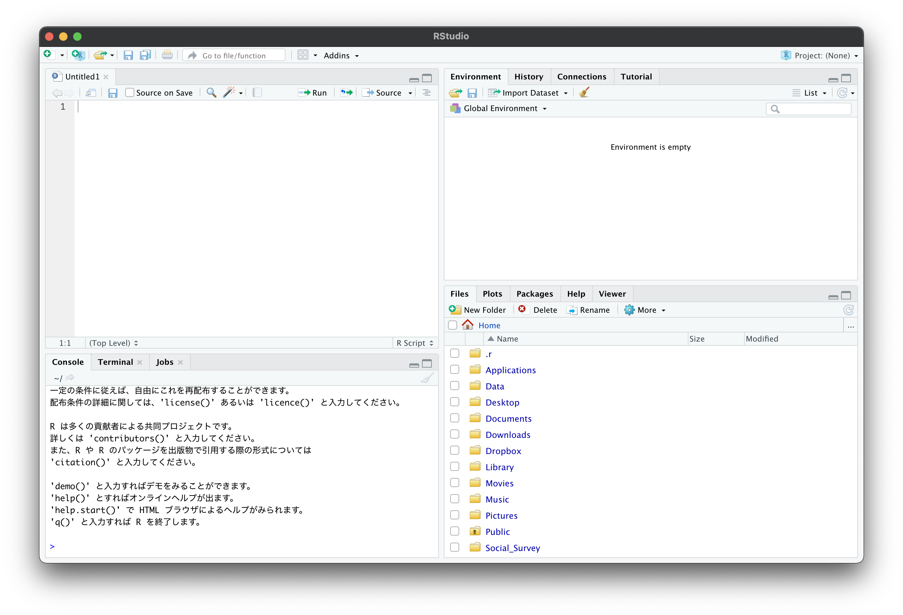
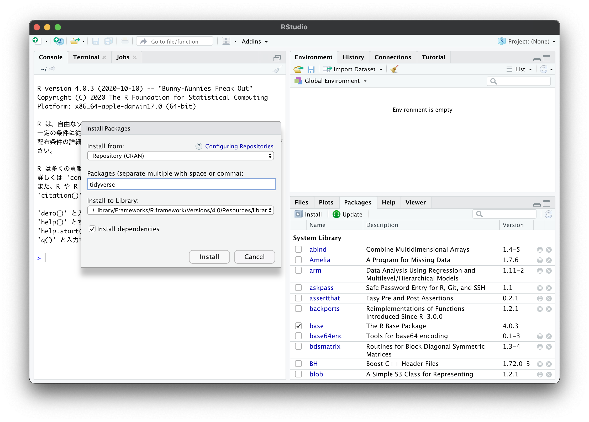

# RとRStudioのインストール {#install}

## Rのインストール

- https://cran.r-project.org/

```{r, echo = FALSE, out.width = '70%'}

```

### ダウンロード
- Macの場合は`Download R for (Mac) OS X`をクリックし，一番上にある`R-4.0.3.pkg (notarized and signed)`をクリックし`R-4.0.3.pkg`をダウンロードする．
- Windowsの場合は`Download R for Windows`をクリックし，一番上の`base`をクリックし，次の画面の`Download R 4.0.3 for Windows (85 megabytes, 32/64 bit)`をクリックして`R-4.0.3-win.exe`をダウンロードする．
- ダウンロードされたらファイルを実行してインストールする．
- 基本的には「OK」と「次へ」を選択する．ただしWindowsの場合，インストール先は日本語が含まれないようなフォルダやOnedrive等以外の場所に設定して下さい．

```{r, echo = FALSE, out.width = '70%'}

```

### MAC
```{r, echo = FALSE, out.width = '50%'}

```


### Windows
```{r, echo = FALSE, out.width = '50%'}

```


### Rの起動
- Rがインストールされたら次のような画面（コンソール）がでてくる．
- 赤字は無視して下さい．

```{r, echo = FALSE, out.width = '50%'}

```

### Rのテスト
- Rコンソール上に，直接入力してテストしましょう．
- `>`の後に`1+2`と入力して，Return（Enter）を押してください．
```{r}
1 + 2
```
- ここまでできればRのテストは完了です．
- 次にRStudioのダウンロードを行います．

## RStudioのインストール

### RStudioのダウンロード
- https://rstudio.com/products/rstudio/

```{r, echo = FALSE, out.width = '50%'}

```

- RStudio DesktopのFreeを探して，DOWNLOADする．
- https://rstudio.com/products/rstudio/download/#download
- MACの場合は`RStudio-1.3.1093.dmg`
- Windowsの場合は`RStudio-1.3.1093.exe`

### RStudioの起動
- RStudioを起動する．
- Windowsの場合は右クリックで，「管理者として実行」とする．
- 次のような画面がでればOK．
- 左下のコンソール上に`1+2`などと入力し，テストしてみましょう．

```{r, echo = FALSE, out.width = '70%'}

```


## 他の参考になるサイト

- Windows
  - Rのインストール
  - https://qiita.com/FukuharaYohei/items/8e0ddd0af11132031355
  - RStudioのインストール
  - https://qiita.com/FukuharaYohei/items/3468bd2a6b2f07b8963e

- Mac
  - https://qiita.com/hujuu/items/ddd66ae8e6f3f989f2c0

## パッケージのインストール

- 右下の画面の**Packages**を選択
- すぐ左下の**Install**を選択する
- 新たに表示された画面の**Packages (separate multiple with space or comma):**の部分に`tidyverse`と入力

```{r, echo = FALSE, out.width = '70%'}

```

## パッケージの呼び出し

- コンソール上に`library(tidyverse)`と入力し，実行してみましょう．
- 以下の様な表示が出ればうまくいっています．

```{r, message = TRUE}
library(tidyverse)
```


## パッケージインストールの際のトラブル

- よくあるエラーについては以下の麦山さんのサイトが参考になります．
  - http://ryotamugiyama.com/2020/08/03/rinstall/

>>エラー: package or namespace load failed for 'tidyverse' in loadNamespace(i, c(lib.loc, .libPaths()), versionCheck = vI[[i]]):

- 古いバージョンのRやRStudioがインストールされている可能性があります．`R.Version()`とコンソールに入力したときに，下の方に`R version 4.0.3 (2020-10-10)`と表示されるか確認してみましょう．

>>OneDrive/????/ といったようなエラーがでる．

- RStudioをOnedriveからアンインストールした上で，別の場所にインストールしてみましょう．日本語の名前ではない場所がよいです．
- RStudioを開く際に右クリックで「管理者として実行」などすればうまくいくかもしれません．

>>どうしてもうまくいかない

- RStudio Cloudを使用するのを推奨することを推奨します．
- Gmailのアカウントを用いてサインインもできます．
- Zipで圧縮してあるファイルはそのままUploadすれば読み込めます．
- https://rstudio.cloud/
