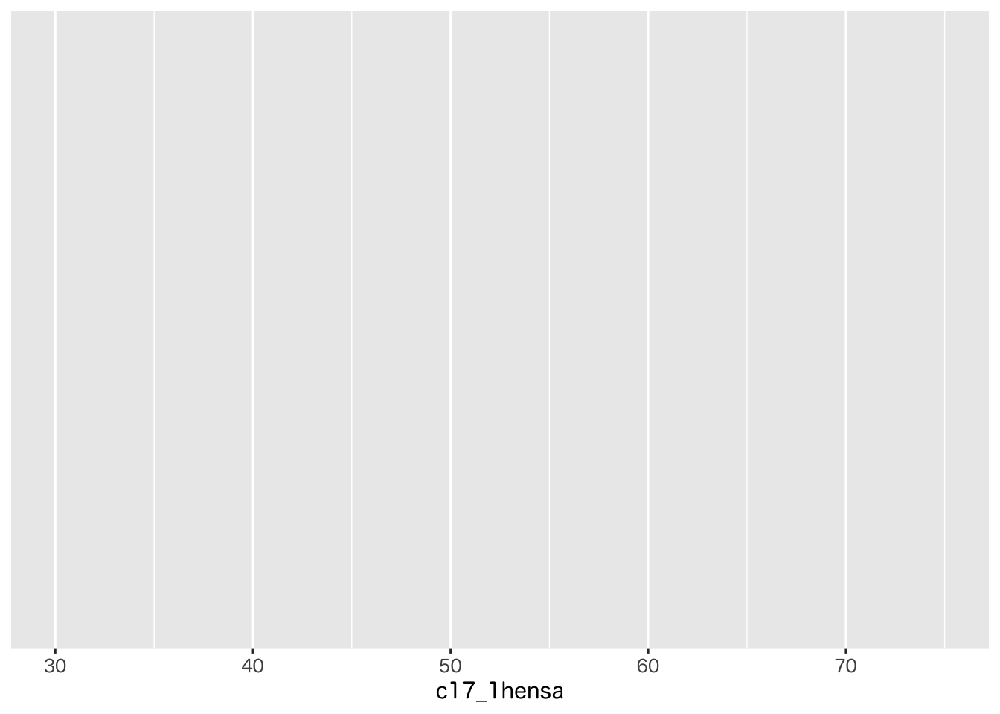
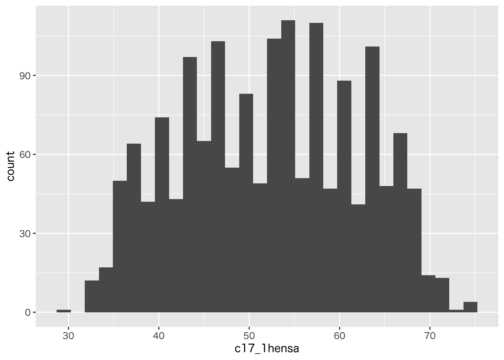

# データの視覚化 {#vizualization}


```r
library(tidyverse)
```

```
## ─ Attaching packages ──────────────────── tidyverse 1.3.1 ─
```

```
## ✓ tibble  3.1.4     ✓ dplyr   1.0.7
## ✓ tidyr   1.1.3     ✓ stringr 1.4.0
## ✓ readr   2.0.1     ✓ forcats 0.5.1
## ✓ purrr   0.3.4
```

```
## ─ Conflicts ───────────────────── tidyverse_conflicts() ─
## x dplyr::filter() masks stats::filter()
## x dplyr::lag()    masks stats::lag()
```


```r
d <- read_csv("data/example_1.csv")
```

```
## Rows: 1854 Columns: 9
```

```
## ─ Column specification ────────────────────────────
## Delimiter: ","
## dbl (9): id, c1_1, c2a, c2b, c2c, c2d, c2e, c17_1hensa, c15a
```

```
## 
## ℹ Use `spec()` to retrieve the full column specification for this data.
## ℹ Specify the column types or set `show_col_types = FALSE` to quiet this message.
```

```r
d
```

```
## # A tibble: 1,854 × 9
##       id  c1_1   c2a   c2b   c2c   c2d   c2e c17_1hensa  c15a
##    <dbl> <dbl> <dbl> <dbl> <dbl> <dbl> <dbl>      <dbl> <dbl>
##  1     1     2     1     5     4     5     2       64.5     1
##  2     2     2     1     4     3     5     3       43       2
##  3     3     1     2     3     3     5     4       41       4
##  4     4     1     1     5     4     5     1       61       1
##  5     5     2     2     2     2     3     3       46       3
##  6     6     1     1     2     3     4     2       44       3
##  7     7     2     1     4     5     5     2       45       3
##  8     8     1     2     5     1     2     2       36       5
##  9     9     2     2     3     4     4     2       60       2
## 10    10     1     1     5     4     5     1       50       3
## # … with 1,844 more rows
```


## ggplotの基礎

### 1変数の場合


```r
ggplot(d, mapping = aes(x = c17_1hensa))
```




```r
ggplot(d, mapping = aes(x = c17_1hensa)) + 
  geom_histogram()
```

```
## `stat_bin()` using `bins = 30`. Pick better value with `binwidth`.
```

```
## Warning: Removed 251 rows containing non-finite values (stat_bin).
```




### 2変数の場合

