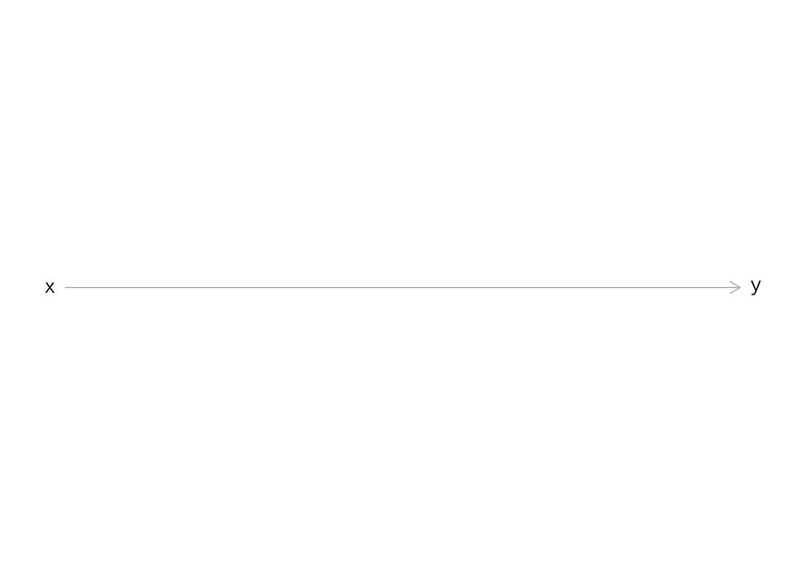
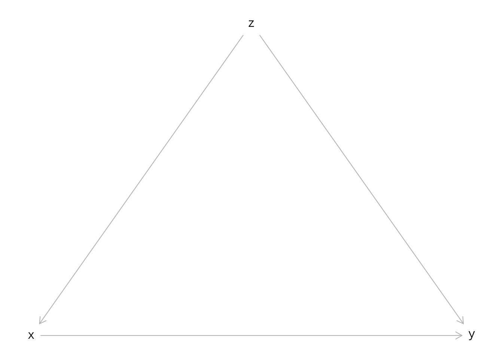
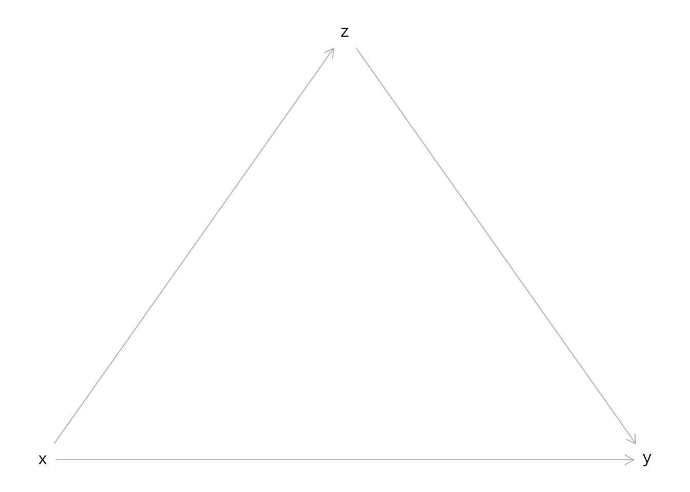

# 有向非巡回グラフ（DAG） {#DAG}


```r
library(dagitty)
library(lavaan)
```

```
## This is lavaan 0.6-9
## lavaan is FREE software! Please report any bugs.
```


```r
g <- dagitty('dag{
  x [pos="0,1"]
  y [pos="1,1"]
  x -> y
 }')
plot(g)
```



## Confounder


```r
g <- dagitty('dag{
  x [pos="0,1"]
  y [pos="1,1"]
  z [pos="0.5,0"]
  x -> y ; x <- z -> y
  }')
plot(g)
```




## Mediator


```r
g <- dagitty('dag{
  x [pos="0,1"]
  y [pos="1,1"]
  z [pos="0.5,0"]
  x -> y;
  x -> z -> y
  }')
plot(g)
```




## Collidar


```r
g <- dagitty('dag{
  x [pos="0,1"]
  y [pos="1,1"]
  z [pos="0.5,0"]
  x -> y;
  x -> z <- y
  }')
plot(g)
```


