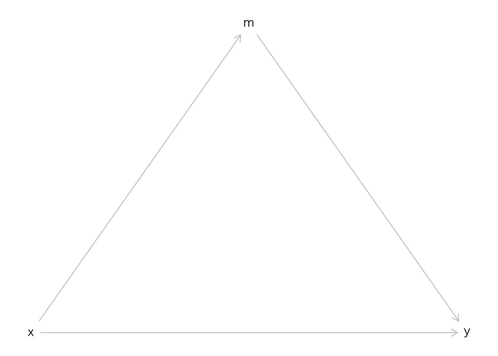
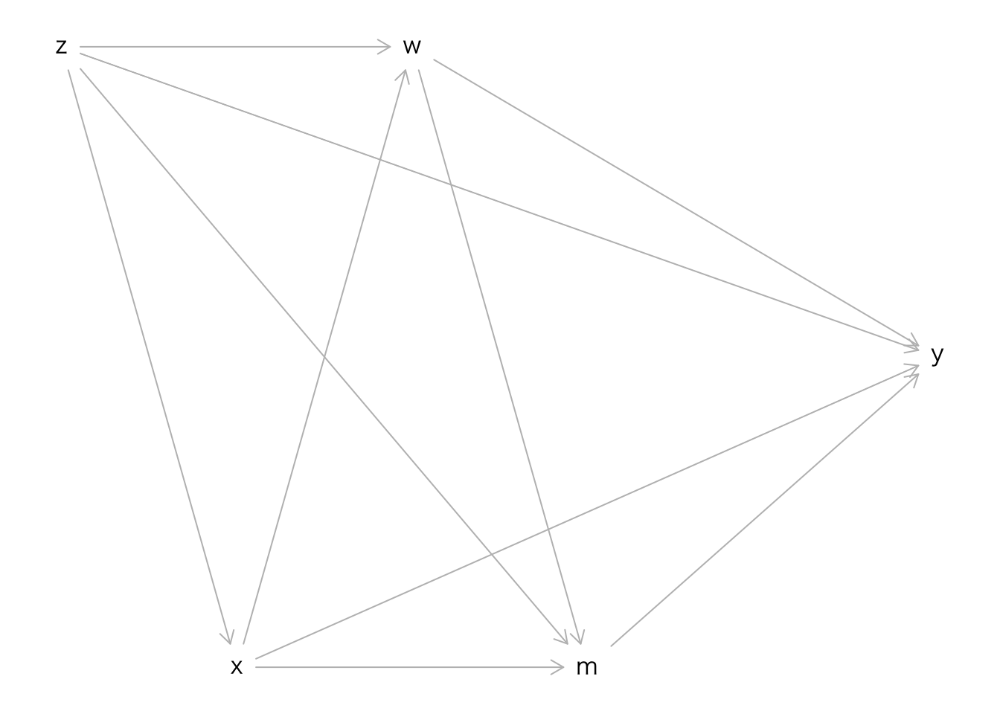

# 媒介分析 {#mediation}


``` r
library(dagitty)
library(lavaan)
```


## Mediator


``` r
g <- dagitty('dag{
  x [pos="0,1"]
  y [pos="1,1"]
  m [pos="0.5,0"]
  x -> y;
  x -> m -> y
  }')
plot(g)
```




## 実際のデータ生成過程


``` r
g <- dagitty('dag{
  x [pos="0,2"]
  y [pos="2,2"]
  m [pos="1,0"]
  z [pos="0,0"]
  x -> y;
  x -> m -> y;
  z -> x;
  z -> m;
  z -> y;
  }')
plot(g)
```


``` r
g <- dagitty('dag{
  x [pos="0,2"]
  y [pos="2,2"]
  m [pos="1,0"]
  z [pos="0,0"]
  w [pos="2,0"]
  x -> y;
  x -> m -> y;
  z -> x;
  z -> m;
  z -> y;
  w -> m;
  w -> y;
  }')
plot(g)
```


## 実際のデータ生成過程（3）

おそらく最も多くの場面では次のような変数間の関連構造が想定できるだろう．


``` r
g <- dagitty('dag{
  x
  y
  m
  z
  w
  z -> x;
  z -> m;
  z -> w;
  z -> y;
  x -> y;
  x -> m;
  x -> w;
  w -> m;
  w -> y;
  m -> y;
  }')

coordinates(g) <-
    list(x = c(z = 0, x = 1, w = 2, m = 3, y = 5),
         y = c(z = 0, x = 1, m = 1, w = 0, y = 0.5)
         )
plot(g)
```


